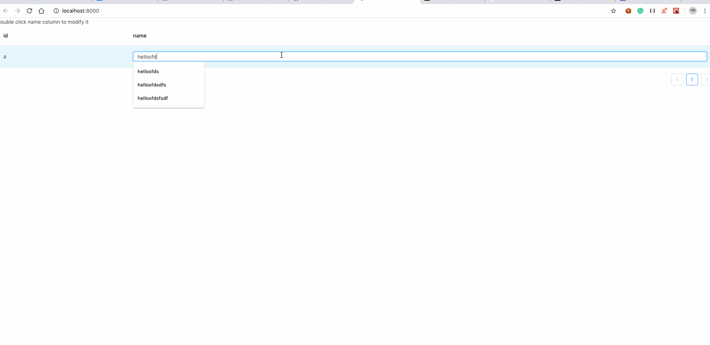

# issue

see below:



`testHooks.js`

```javascript
import { useState, useMemo, useCallback } from "react";
import { createModel } from "hox";

function testHooks() {
  const [users, setUsers] = useState([
    {
      id: "a",
      name: "hello"
    }
  ]);

  const removeUser = useCallback(
    user => {
      return new Promise(resolve => {
        setTimeout(() => {
          // async work here
          setUsers(users.filter(u => u.name !== user.name));
          resolve();
        }, 10);
      });
    },
    [users]
  );

  const addUser = useCallback(
    user => {
      return new Promise(resolve => {
        setTimeout(() => {
          // async work here
          // users here is not up-to-date
          setUsers([...users, user]);
          resolve();
        }, 10);
      });
    },
    [users]
  );

  //modify user = remove old-user + add new-user
  const modifyUser = useCallback(
    (oldUser, newUser) => {
      return new Promise((resolve, reject) => {
        removeUser(oldUser)
          .then(() => {
            // addUser relies on latest users updated by removeUser
            // but due to closure issue, it refers to original value
            // what is the best approach to achieve the expected behivour?
            return addUser(newUser);
          })
          .then(resolve, reject);
      });
    },
    [users]
  );

  return {
    users,
    modifyUser
  };
}

export default createModel(testHooks);
```
